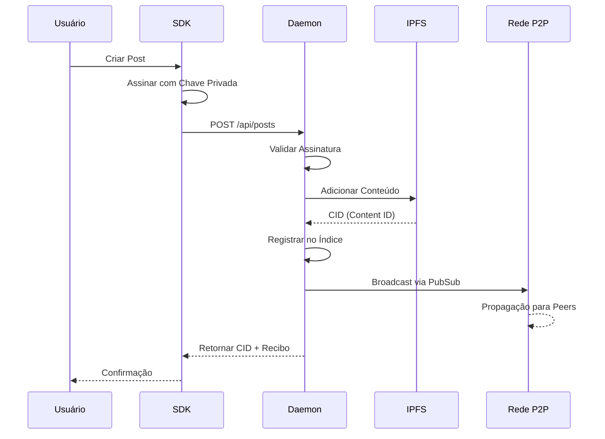
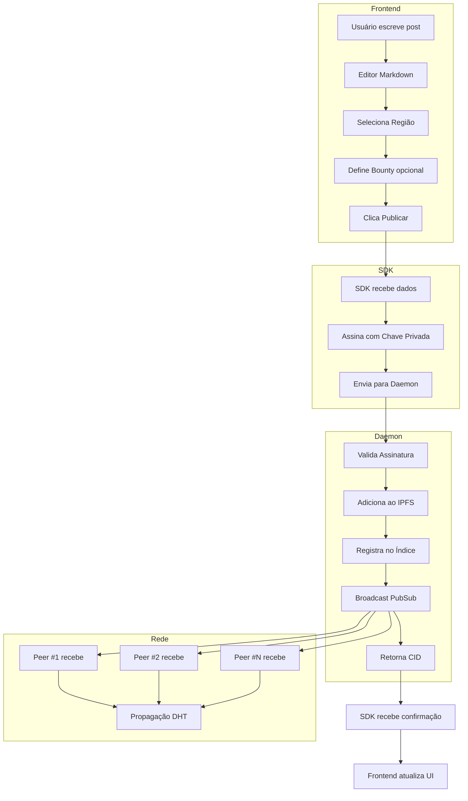

# 02. Arquitetura do Sistema e Stack Tecnológico

## Visão Geral

O Protocolo Iceberg é estruturado como um **Monorepo** contendo três camadas principais que se comunicam de forma desacoplada.

```
┌─────────────────────────────────────────────────────────────┐
│                    CAMADA DE APRESENTAÇÃO                    │
│  ┌─────────────┐  ┌─────────────┐  ┌─────────────────────┐  │
│  │  Web Client │  │   Mobile    │  │   Apps de Terceiros │  │
│  │  (Next.js)  │  │   (React    │  │   (Via SDK/API)     │  │
│  │             │  │   Native)   │  │                     │  │
│  └──────┬──────┘  └──────┬──────┘  └──────────┬──────────┘  │
└─────────┼────────────────┼────────────────────┼─────────────┘
          │                │                    │
          ▼                ▼                    ▼
┌─────────────────────────────────────────────────────────────┐
│                      CAMADA DE SDK                           │
│  ┌─────────────────────────────────────────────────────────┐│
│  │              @iceberg/sdk (TypeScript)                  ││
│  │  - Abstração de criptografia                            ││
│  │  - Comunicação com Daemon                               ││
│  │  - Gerenciamento de identidade                          ││
│  └─────────────────────────┬───────────────────────────────┘│
└─────────────────────────────┼───────────────────────────────┘
                              │ HTTP/WebSocket (localhost)
                              ▼
┌─────────────────────────────────────────────────────────────┐
│                    CAMADA DE PROTOCOLO                       │
│  ┌─────────────────────────────────────────────────────────┐│
│  │              Core Daemon (Go/Rust)                      ││
│  │  ┌─────────┐  ┌─────────┐  ┌─────────┐  ┌─────────┐    ││
│  │  │  IPFS   │  │ Libp2p  │  │  Tor    │  │ OrbitDB │    ││
│  │  │ Storage │  │ Network │  │ Onion   │  │  Index  │    ││
│  │  └────┬────┘  └────┬────┘  └────┬────┘  └────┬────┘    ││
│  │       │            │            │            │          ││
│  │       └────────────┴────────────┴────────────┘          ││
│  │                         │                               ││
│  └─────────────────────────┼───────────────────────────────┘│
└─────────────────────────────┼───────────────────────────────┘
                              │
                              ▼
┌─────────────────────────────────────────────────────────────┐
│                    REDE DISTRIBUÍDA                          │
│  ┌───────┐  ┌───────┐  ┌───────┐  ┌───────┐  ┌───────┐     │
│  │ Peer  │  │ Peer  │  │ Peer  │  │ Peer  │  │ Peer  │     │
│  │  #1   │◄─►  #2   │◄─►  #3   │◄─►  #4   │◄─►  #N   │     │
│  └───────┘  └───────┘  └───────┘  └───────┘  └───────┘     │
└─────────────────────────────────────────────────────────────┘
```

---

## Estrutura do Monorepo

```
crom-protocolo-iceberg/
├── docs/                    # Documentação (você está aqui)
│
├── packages/
│   ├── core-daemon/         # O "Motor" P2P (Backend)
│   │   ├── cmd/             # Entrypoints (CLI)
│   │   ├── internal/        # Lógica interna
│   │   │   ├── consensus/   # Regras de níveis
│   │   │   ├── crypto/      # Criptografia
│   │   │   ├── ipfs/        # Integração IPFS
│   │   │   ├── network/     # Libp2p + Tor
│   │   │   ├── storage/     # OrbitDB wrapper
│   │   │   └── api/         # HTTP Server local
│   │   ├── go.mod
│   │   └── Makefile
│   │
│   ├── sdk/                 # Biblioteca para desenvolvedores
│   │   ├── src/
│   │   │   ├── client/      # HTTP client para daemon
│   │   │   ├── crypto/      # Wrapper de criptografia
│   │   │   ├── identity/    # Gerenciamento de chaves
│   │   │   └── types/       # TypeScript types
│   │   ├── package.json
│   │   └── tsconfig.json
│   │
│   └── web-client/          # Frontend (Fork do TabNews)
│       ├── pages/           # Next.js pages
│       ├── components/      # React components
│       ├── styles/          # Tailwind CSS
│       ├── lib/             # Utilitários
│       ├── public/          # Assets estáticos
│       ├── package.json
│       └── next.config.js
│
├── apps/
│   ├── desktop/             # App Electron/Tauri (futuro)
│   └── mobile/              # React Native (futuro)
│
├── config/
│   ├── consensus_rules.json # Regras de consenso mutáveis
│   └── bootstrap_nodes.json # Nós iniciais da rede
│
├── scripts/                 # Scripts de build e deploy
├── .github/                 # GitHub Actions
├── package.json             # Workspace root
├── turbo.json               # Turborepo config
└── README.md
```

---

## 1. Core Daemon (O Coração do Sistema)

### Especificações Técnicas

| Aspecto           | Especificação                   |
| ----------------- | ------------------------------- |
| **Linguagem**     | Go 1.21+ (preferencial) ou Rust |
| **Rede P2P**      | Libp2p com DHT (Kademlia)       |
| **Armazenamento** | IPFS (go-ipfs embedded)         |
| **Índice**        | OrbitDB ou GunDB                |
| **Anonimato**     | Tor Onion Services (opcional)   |
| **API Local**     | HTTP REST + WebSocket           |
| **Porta Padrão**  | 8420 (API) / 4001 (IPFS)        |
| **Base P2P**      | [crom-nodus](https://github.com/MrJc01/crom-nodus) `@nodus/core` |

> [!NOTE]
> O Iceberg utiliza o **crom-nodus** como base para a camada P2P, aproveitando
> sua infraestrutura de relay, criptografia e CLI já implementadas.
> Ver [11_INTEGRACAO_NODUS_CLI.md](./11_INTEGRACAO_NODUS_CLI.md) para detalhes.

### Módulos do Daemon

```go
// Estrutura conceitual dos módulos principais

package daemon

type IcebergDaemon struct {
    // Rede P2P
    Host        libp2p.Host
    DHT         *dht.IpfsDHT
    PubSub      *pubsub.PubSub

    // Armazenamento
    IPFS        *ipfscore.IpfsNode
    IndexDB     *orbitdb.OrbitDB

    // Consenso
    Consensus   *consensus.Engine
    GeoIndex    *geo.RegionalIndex

    // Identidade
    Identity    *identity.Manager

    // API
    HTTPServer  *api.Server
}
```

### Fluxo de Dados do Daemon



---

## 2. SDK (A Ponte para Desenvolvedores)

### Stack Técnico

| Aspecto        | Especificação         |
| -------------- | --------------------- |
| **Linguagem**  | TypeScript            |
| **Runtime**    | Node.js 18+ / Browser |
| **Bundler**    | tsup/esbuild          |
| **Publicação** | NPM (@iceberg/sdk)    |

### API do SDK

```typescript
// @iceberg/sdk - Interface principal

import { Iceberg, IcebergConfig } from "@iceberg/sdk";

// Configuração
const config: IcebergConfig = {
  // Conexão com daemon local ou remoto
  daemonUrl: "http://localhost:8420",

  // Caminho para arquivo de identidade (opcional)
  identityPath: "~/.iceberg/identity.json",

  // Região geográfica padrão
  defaultRegion: "BR-SP-SAO_PAULO",

  // Timeout para operações (ms)
  timeout: 30000,
};

const client = new Iceberg(config);

// ============================================
// IDENTIDADE
// ============================================

// Criar nova identidade (par de chaves)
const identity = await client.identity.create();
// Retorna: { publicKey: string, privateKey: string (encriptada) }

// Importar identidade existente
await client.identity.import(privateKeyOrSeedPhrase);

// Obter identidade atual
const me = await client.identity.whoami();
// Retorna: { publicKey, reputation, createdAt }

// ============================================
// POSTS
// ============================================

// Listar posts de uma região
const posts = await client.posts.list({
  region: "BR-SP-SAO_PAULO", // GeoHash ou código de cidade
  level: 1, // 0, 1, 2 ou 3
  limit: 50,
  offset: 0,
  sortBy: "relevance", // 'relevance' | 'recent' | 'controversial'
});

// Obter post específico
const post = await client.posts.get(cid);

// Criar novo post
const receipt = await client.posts.create({
  title: "Denúncia de Corrupção",
  body: "## Contexto\n\nMeu relato em Markdown...",
  region: "BR-SP-SAO_PAULO",
  category: "corruption",
  attachments: [
    { type: "image", cid: "Qm..." },
    { type: "document", cid: "Qm..." },
  ],
  bounty: {
    amount: 100,
    token: "ICEBERG", // ou 'XMR' para Monero
  },
});

// ============================================
// VOTOS
// ============================================

// Votar em um post (assinatura criptográfica)
await client.votes.cast(postCid, "up"); // ou 'down' ou 'report'

// Obter votos de um post
const votes = await client.votes.get(postCid);
// Retorna: { up: number, down: number, reports: number, level: number }

// ============================================
// COMENTÁRIOS
// ============================================

// Listar comentários de um post
const comments = await client.comments.list(postCid);

// Criar comentário
await client.comments.create({
  parentCid: postCid, // ou CID de outro comentário
  body: "Minha resposta em Markdown...",
});

// ============================================
// ARQUIVOS
// ============================================

// Upload de arquivo para IPFS
const fileCid = await client.files.upload(fileBuffer, {
  encrypt: true, // Encriptar antes de enviar
  pin: true, // Manter pinado localmente
});

// Download de arquivo
const fileBuffer = await client.files.download(cid);

// ============================================
// CONSENSO
// ============================================

// Verificar nível atual de um post
const level = await client.consensus.checkLevel(postCid);

// Obter métricas de consenso
const metrics = await client.consensus.metrics(postCid);
// Retorna: { seeds, votes, regions, level, nextLevelProgress }
```

---

## 3. Web Client (Frontend)

### Base: Fork do TabNews

O frontend é um **fork adaptado** do [TabNews](https://github.com/filipedeschamps/tabnews.com.br).

### Modificações Necessárias

| Área               | Original (TabNews) | Modificação (Iceberg) |
| ------------------ | ------------------ | --------------------- |
| **Autenticação**   | Email/Senha        | Chaves ED25519        |
| **Banco de Dados** | PostgreSQL         | SDK Iceberg           |
| **API**            | `/pages/api/*`     | Daemon local          |
| **TabCoins**       | Centralizado       | Votos assinados       |
| **Hospedagem**     | Vercel             | IPFS/Qualquer lugar   |

### Stack do Frontend

| Aspecto         | Especificação            |
| --------------- | ------------------------ |
| **Framework**   | Next.js 14+ (App Router) |
| **Estilização** | Tailwind CSS             |
| **Estado**      | Zustand ou Jotai         |
| **Markdown**    | remark/rehype            |
| **Editor**      | CodeMirror ou Monaco     |

### Estrutura de Páginas

```
web-client/
├── app/
│   ├── layout.tsx           # Layout principal
│   ├── page.tsx             # Feed principal
│   ├── auth/
│   │   ├── create/page.tsx  # Criar identidade
│   │   └── import/page.tsx  # Importar identidade
│   ├── post/
│   │   ├── [cid]/page.tsx   # Visualizar post
│   │   └── new/page.tsx     # Criar post
│   ├── user/
│   │   └── [pubkey]/page.tsx # Perfil público
│   └── settings/
│       └── page.tsx         # Configurações
├── components/
│   ├── PostCard.tsx         # Card de post com borda de nível
│   ├── LevelBadge.tsx       # Badge visual do nível
│   ├── VoteButtons.tsx      # Botões de voto
│   ├── MarkdownEditor.tsx   # Editor de markdown
│   ├── RegionSelector.tsx   # Seletor de região
│   └── IdentityAvatar.tsx   # Avatar gerado da pubkey
└── lib/
    ├── iceberg.ts           # Instância do SDK
    └── hooks/               # React hooks customizados
```

---

## 4. Comunicação Entre Camadas

### Fluxo Completo de Criação de Post



---

## 5. Requisitos de Hardware

### Daemon (Nó Completo)

| Recurso | Mínimo    | Recomendado |
| ------- | --------- | ----------- |
| CPU     | 2 cores   | 4+ cores    |
| RAM     | 2 GB      | 8 GB        |
| Disco   | 20 GB SSD | 100 GB+ SSD |
| Rede    | 10 Mbps   | 100 Mbps    |

### Cliente Web (Navegador)

| Recurso    | Mínimo                              |
| ---------- | ----------------------------------- |
| Navegador  | Chrome 90+, Firefox 90+, Safari 15+ |
| JavaScript | ES2020+                             |
| WebCrypto  | Obrigatório                         |

---

## 6. Variáveis de Ambiente

### Daemon

```bash
# .env do daemon
ICEBERG_API_PORT=8420
ICEBERG_IPFS_PORT=4001
ICEBERG_DATA_DIR=~/.iceberg
ICEBERG_ENABLE_TOR=false
ICEBERG_BOOTSTRAP_NODES=config/bootstrap_nodes.json
ICEBERG_CONSENSUS_RULES=config/consensus_rules.json
ICEBERG_LOG_LEVEL=info
```

### Web Client

```bash
# .env.local do frontend
NEXT_PUBLIC_DAEMON_URL=http://localhost:8420
NEXT_PUBLIC_DEFAULT_REGION=BR-SP-SAO_PAULO
NEXT_PUBLIC_IBGE_API=https://servicodados.ibge.gov.br/api/v1
```

---

## Próximo Documento

Veja [03_LOGICA_DE_CONSENSO.md](./03_LOGICA_DE_CONSENSO.md) para entender como funciona o sistema de níveis e validação distribuída.
