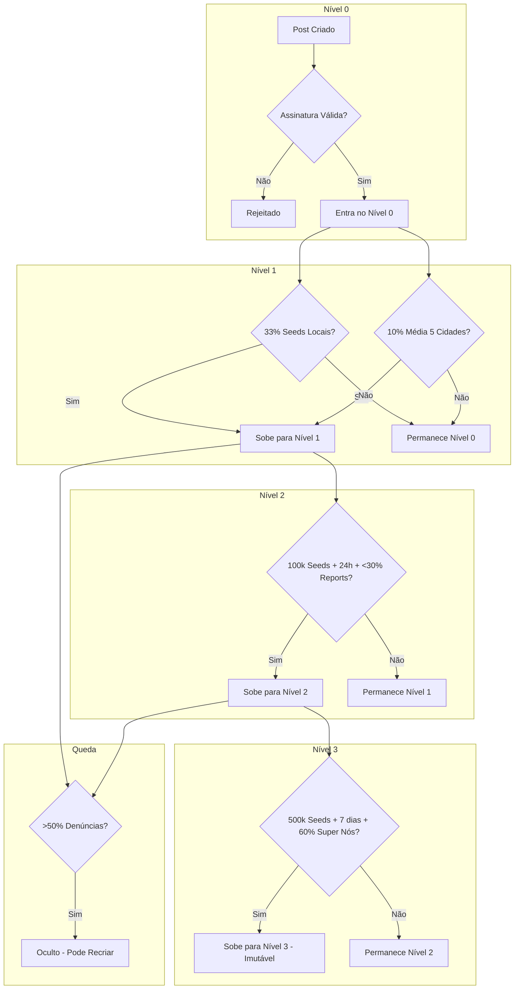

# 03. Lógica de Consenso e Sistema de Níveis

## Visão Geral

O Protocolo Iceberg utiliza um sistema hierárquico de **4 níveis** (0 a 3) para classificar a visibilidade e confiabilidade das informações. A promoção entre níveis é determinada por **consenso distribuído**, não por moderadores centralizados.

---

## O Modelo "Iceberg"

```
                    ┌─────────────────┐
                    │    NÍVEL 3      │  ← Verdade Histórica (Global, Imutável)
                    │    "Legacy"     │
                    └────────┬────────┘
                             │
              ┌──────────────┴──────────────┐
              │          NÍVEL 2            │  ← Verificado Globalmente (Surface)
              │         "Surface"           │
              └──────────────┬──────────────┘
                             │
       ┌─────────────────────┴─────────────────────┐
       │                  NÍVEL 1                  │  ← Verificado Regionalmente
       │                "Regional"                 │
       └─────────────────────┬─────────────────────┘
                             │
┌────────────────────────────┴────────────────────────────┐
│                        NÍVEL 0                          │  ← Entrada Bruta (Deep)
│                      "The Wild"                         │
└─────────────────────────────────────────────────────────┘
```

---

## Definição Detalhada dos Níveis

### Nível 0: The Wild (O Submundo)

| Aspecto                  | Especificação                         |
| ------------------------ | ------------------------------------- |
| **Nome**                 | The Wild / O Bruto                    |
| **Visibilidade**         | Apenas via link direto (hash/CID)     |
| **Audiência**            | Perfis "Ativista" e "Auditor"         |
| **Armazenamento**        | Temporário (cache do autor + acessos) |
| **Requisito de Entrada** | Assinatura criptográfica válida       |
| **Objetivo**             | Coleta inicial e primeira auditoria   |

**Características:**

- Todo conteúdo novo entra aqui automaticamente
- Não aparece em feeds públicos ou buscas
- O autor é o único "seeder" inicial
- Se o autor desligar o PC sem outros seeds, o conteúdo pode se perder
- Ideal para compartilhamento privado via chat criptografado

**Quem vê:**

- Qualquer pessoa com o link direto (hash)
- Usuários com perfil "Ativista" (podem navegar o Nível 0)
- Bots de auditoria automatizada

---

### Nível 1: Regional (Verificado Localmente)

| Aspecto           | Especificação                           |
| ----------------- | --------------------------------------- |
| **Nome**          | Regional / Cidade                       |
| **Visibilidade**  | Feed de usuários na mesma cidade/região |
| **Audiência**     | Todos os perfis na região geográfica    |
| **Armazenamento** | Replicado em nós regionais              |
| **Requisito**     | Ver critérios de promoção abaixo        |
| **Objetivo**      | Alerta comunitário local                |

**Critérios de Promoção (Nível 0 → 1):**

O conteúdo sobe para Nível 1 se **UMA** das condições for atendida:

#### Opção A: Domínio Local

```
seeds_locais >= ativos_na_cidade × 0.33
```

> Se 33% dos nós ativos na cidade estão hospedando (seeding) o conteúdo.

#### Opção B: Validação Cruzada (Regra das 5 Cidades)

```
media_votos_positivos(5_cidades_vizinhas) >= 0.10
```

> Se a média de aprovação em 5 cidades vizinhas (sorteadas ou próximas) for maior que 10%.

**Por que duas opções?**

- **Opção A:** Reflete engajamento orgânico local
- **Opção B:** Impede que uma cidade "censure" informação verdadeira por medo ou pressão

---

### Nível 2: Surface (Verificado Globalmente)

| Aspecto           | Especificação                         |
| ----------------- | ------------------------------------- |
| **Nome**          | Surface / Público                     |
| **Visibilidade**  | Global (página inicial padrão)        |
| **Audiência**     | Todos os usuários do mundo            |
| **Armazenamento** | Altamente replicado (milhares de nós) |
| **Requisito**     | Ver critérios de promoção abaixo      |
| **Objetivo**      | Mídia de massa, pressão política      |

**Critérios de Promoção (Nível 1 → 2):**

```
seeds_globais >= 100_000
AND
tempo_no_nivel_1 >= 24_horas
AND
taxa_denuncia < 0.30
```

> - Mais de 100.000 instâncias hospedando
> - Mínimo de 24 horas no Nível 1 sem ser derrubado
> - Taxa de denúncias abaixo de 30%

---

### Nível 3: Legacy (Arquivo Histórico)

| Aspecto           | Especificação                            |
| ----------------- | ---------------------------------------- |
| **Nome**          | Legacy / Imutável                        |
| **Visibilidade**  | Global + Arquivo Permanente              |
| **Audiência**     | Toda a humanidade, para sempre           |
| **Armazenamento** | Blockchain permanente (Arweave/Filecoin) |
| **Requisito**     | Consenso massivo + tempo                 |
| **Objetivo**      | Prova jurídica, memória histórica        |

**Critérios de Promoção (Nível 2 → 3):**

```
seeds_globais >= 500_000
AND
tempo_no_nivel_2 >= 7_dias
AND
validacao_super_nos >= 0.60
AND
redundancia_internacional >= 3_continentes
```

> - Mais de 500.000 seeds
> - 7 dias estável no Nível 2
> - 60% dos "Super Nós" (ONGs, jornalistas verificados) validaram
> - Cópias em pelo menos 3 continentes diferentes

**Características Especiais do Nível 3:**

- Conteúdo é gravado em blockchain de armazenamento permanente
- **Não pode ser removido** por ninguém, nem pela comunidade
- Serve como prova jurídica com validade notarial (timestamp + hash)
- Custo de armazenamento é coberto pelo protocolo (taxas de transação)

---

## Mecanismo de Queda

### Gatilho de Remoção

```
SE denuncias > (votos_totais × 0.50)
ENTÃO status = "oculto"
```

> Se mais de 50% das interações forem denúncias, o conteúdo é oculto.

### Proteção Anti-Censura

Para evitar que ataques coordenados derrubem verdades inconvenientes:

```
SE seeds_ativos > 50_000
ENTÃO limite_denuncia = denuncias_necessarias × log10(seeds_ativos)
```

> Quanto mais pessoas hospedam o conteúdo, mais difícil é derrubá-lo.

**Exemplo:**

- Post com 1.000 seeds: precisa de 500 denúncias para cair
- Post com 100.000 seeds: precisa de ~2.500 denúncias para cair

### Reinício (Reset de Hash)

Quando um conteúdo cai, o autor pode tentar novamente, mas:

1. O Hash original entra numa **Blacklist Temporária** (7 dias)
2. Para repostar, deve adicionar um "Sal" (salt) criptográfico
3. Isso gera um **Novo CID** completamente diferente
4. O novo post começa do Nível 0, **sem histórico anterior**

```typescript
// Exemplo de geração de novo hash
const novoConteudo = {
  ...conteudoOriginal,
  salt: crypto.randomBytes(16).toString("hex"),
  versao: 2,
};
// CID antigo: Qm... (banido)
// CID novo: Qm... (diferente, começa do zero)
```

---

## Algoritmo de Densidade Populacional

### O Problema

"33% de São Paulo" é impossível (4 milhões de pessoas).
"33% de Borá-SP" são 15 pessoas.

### A Solução: Fórmula Logarítmica

```
threshold = log10(populacao) × fator_dificuldade × taxa_engajamento
```

**Onde:**

- `populacao`: Habitantes da cidade (dado do IBGE)
- `fator_dificuldade`: Configurável via `consensus_rules.json` (padrão: 1.0)
- `taxa_engajamento`: Proporção de usuários ativos na plataforma

### Tabela de Referência

| Cidade       | População  | Threshold Nível 1 |
| ------------ | ---------- | ----------------- |
| Borá-SP      | 838        | ~2.9 × fator      |
| Jundiaí-SP   | 423.000    | ~5.6 × fator      |
| Campinas-SP  | 1.213.000  | ~6.0 × fator      |
| São Paulo-SP | 12.400.000 | ~7.0 × fator      |

### Configuração Mutável

O arquivo `config/consensus_rules.json` permite ajustar:

```json
{
  "version": "1.0.0",
  "level_1": {
    "local_dominance_percent": 0.33,
    "cross_validation_cities": 5,
    "cross_validation_threshold": 0.1,
    "min_seeds_absolute": 10,
    "population_factor": 1.0
  },
  "level_2": {
    "min_seeds": 100000,
    "min_time_hours": 24,
    "max_report_ratio": 0.3
  },
  "level_3": {
    "min_seeds": 500000,
    "min_time_days": 7,
    "super_node_approval": 0.6,
    "min_continents": 3
  },
  "fall_rules": {
    "report_threshold": 0.5,
    "blacklist_days": 7,
    "protection_log_factor": true
  }
}
```

---

## Sistema de Geolocalização

### Hierarquia Geográfica

```
Brasil (BR)
└── Estado (BR-SP)
    └── Cidade (BR-SP-SAO_PAULO)
        └── Bairro (futuro: BR-SP-SAO_PAULO-PINHEIROS)
```

### Fonte de Dados

O sistema utiliza a **API do IBGE** para:

- Lista oficial de cidades
- Códigos municipais
- Estimativas populacionais
- Coordenadas geográficas

```typescript
// Exemplo de consulta
const cidade = await ibge.getMunicipio("3550308"); // São Paulo
// Retorna: { nome, populacao, coordenadas, vizinhos }
```

### Privacidade da Localização

> [!IMPORTANT]
> O sistema **NÃO** rastreia a localização real do usuário.

**Como funciona:**

1. Usuário **escolhe** sua região de interesse
2. O app baixa conteúdo dessa região + regiões aleatórias (decoy)
3. Observadores externos não sabem onde o usuário realmente está

```typescript
// O usuário diz "Estou em São Paulo"
// O app baixa: São Paulo + Curitiba + Recife + Salvador (decoys)
// Resultado: Ninguém sabe que ele está em São Paulo
```

---

## Fluxo Visual de Promoção



---

## Implementação de Referência

### Estrutura do Consensus Engine

```go
// packages/core-daemon/internal/consensus/engine.go

package consensus

import (
    "github.com/iceberg/core-daemon/internal/geo"
    "github.com/iceberg/core-daemon/internal/storage"
)

type Engine struct {
    rules      Rules           // Carregado de consensus_rules.json
    geoIndex   *geo.Index      // Índice geográfico (IBGE)
    storage    *storage.DB     // OrbitDB wrapper
}

// CheckLevel verifica o nível atual de um CID
func (e *Engine) CheckLevel(cid string) (Level, error) {
    metrics, err := e.storage.GetMetrics(cid)
    if err != nil {
        return Level0, err
    }

    // Verificar critérios de cada nível
    if e.meetsLevel3Criteria(metrics) {
        return Level3, nil
    }
    if e.meetsLevel2Criteria(metrics) {
        return Level2, nil
    }
    if e.meetsLevel1Criteria(metrics) {
        return Level1, nil
    }

    return Level0, nil
}

// meetsLevel1Criteria verifica promoção para Nível 1
func (e *Engine) meetsLevel1Criteria(m Metrics) bool {
    // Opção A: Domínio Local
    localRatio := float64(m.LocalSeeds) / float64(m.ActiveLocalPeers)
    if localRatio >= e.rules.Level1.LocalDominancePercent {
        return true
    }

    // Opção B: Validação Cruzada
    if m.CrossCityAverage >= e.rules.Level1.CrossValidationThreshold {
        return true
    }

    return false
}
```

---

## Próximo Documento

Veja [04_ESPECIFICACAO_FRONTEND.md](./04_ESPECIFICACAO_FRONTEND.md) para entender como adaptar o TabNews para esta arquitetura.
