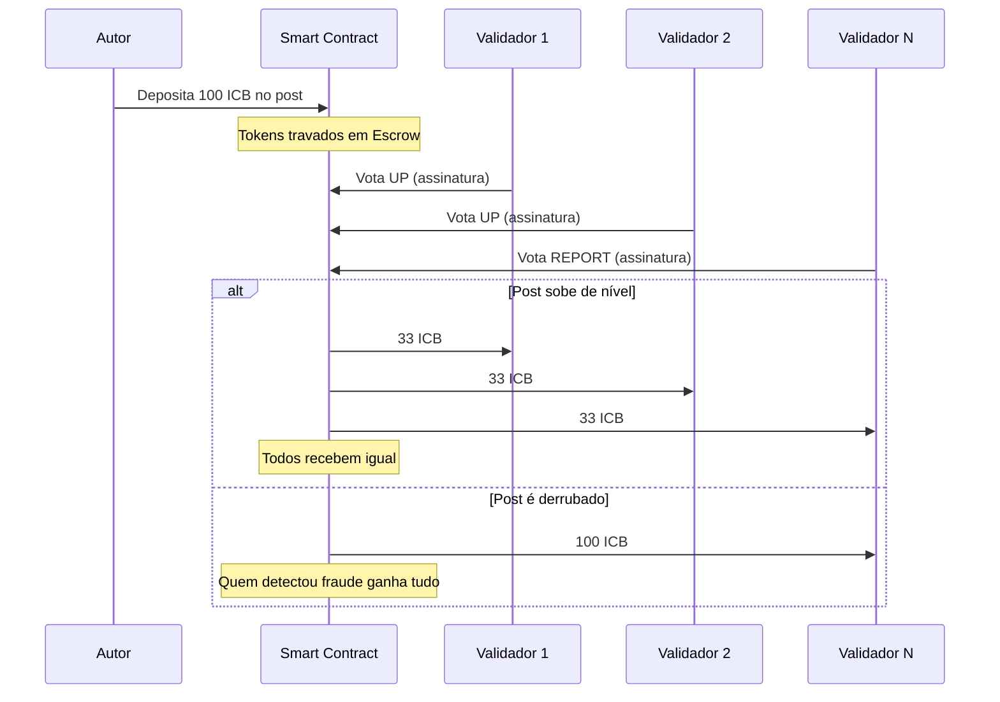
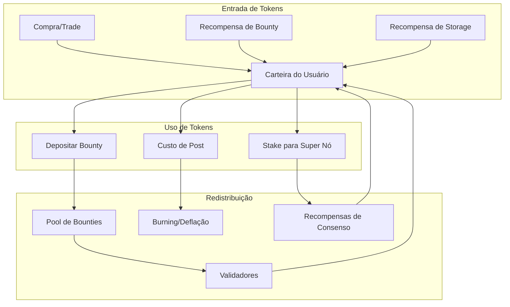

# 05. Tokenomics e Sistema de Incentivos

## Visão Geral

O Protocolo Iceberg utiliza um sistema de incentivos econômicos para:

1. **Acelerar a verificação** de denúncias
2. **Manter a rede operacional** (hospedagem/seeding)
3. **Premiar comportamento honesto** e punir fraudes
4. **Evitar spam** e ataques Sybil

---

## Economia do Sistema

### Token ICEBERG (Opcional)

> [!NOTE]
> O token nativo é **opcional**. O sistema pode funcionar apenas com reputação.
> O token adiciona camada de incentivo financeiro real.

| Aspecto           | Especificação                           |
| ----------------- | --------------------------------------- |
| **Nome**          | ICEBERG (ICB)                           |
| **Tipo**          | Utility Token                           |
| **Blockchain**    | Polygon/Arbitrum (baixas taxas)         |
| **Supply**        | Infinito (mint controlado por consenso) |
| **Uso Principal** | Bounties, Staking, Tax fees             |

### Alternativa: Sistema de Reputação Pura

Para quem não quer usar criptomoedas:

| Aspecto           | Especificação                        |
| ----------------- | ------------------------------------ |
| **Nome**          | TrustScore                           |
| **Tipo**          | Pontuação interna                    |
| **Armazenamento** | Assinaturas criptográficas agregadas |
| **Transferível**  | Não                                  |
| **Uso**           | Peso de voto, acesso a features      |

---

## 1. Bounty System (Recompensa por Auditoria)

### Fluxo do Bounty



### Regras do Bounty

```typescript
interface BountyConfig {
  // Valor mínimo de bounty (anti-spam)
  minAmount: 10; // ICB

  // Máximo de validadores que recebem
  maxRecipients: 100;

  // Tempo máximo para distribuição
  maxTimeHours: 72;

  // Divisão de recompensa
  split: {
    // Se o post sobe de nível
    promotion: "equal"; // Todos recebem igual

    // Se o post é derrubado
    demotion: "reporters_only"; // Só quem reportou
  };
}
```

### Implementação do Bounty

```typescript
// packages/sdk/src/bounty.ts

class BountyManager {
  async deposit(postCid: string, amount: number): Promise<TransactionReceipt> {
    // Verificar saldo do usuário
    const balance = await this.getBalance();
    if (balance < amount) {
      throw new Error("Saldo insuficiente");
    }

    // Criar transação de depósito
    const tx = {
      type: "bounty_deposit",
      postCid,
      amount,
      timestamp: Date.now(),
      expiresAt: Date.now() + 72 * 60 * 60 * 1000, // 72h
    };

    // Assinar e broadcast
    const signedTx = await this.identity.sign(tx);
    await this.network.broadcast(signedTx);

    return { txId: signedTx.hash, status: "pending" };
  }

  async claim(postCid: string): Promise<TransactionReceipt> {
    // Verificar se o usuário votou neste post
    const myVote = await this.votes.getMine(postCid);
    if (!myVote) {
      throw new Error("Você não votou neste post");
    }

    // Verificar status do bounty
    const bounty = await this.getBountyStatus(postCid);
    if (bounty.status !== "claimable") {
      throw new Error(`Bounty não disponível: ${bounty.status}`);
    }

    // Calcular share
    const share = bounty.amount / bounty.eligibleVoters;

    // Criar transação de claim
    const tx = {
      type: "bounty_claim",
      postCid,
      amount: share,
      voteProof: myVote.signature,
    };

    return this.submitTransaction(tx);
  }
}
```

---

## 2. Proof of Storage (Recompensa por Hospedagem)

### Conceito

Usuários que mantêm o daemon rodando e hospedam conteúdo da rede são recompensados.

### Desafio de Verificação

O sistema periodicamente "desafia" os nós:

```typescript
interface StorageChallenge {
  // CID do arquivo a verificar
  targetCid: string;

  // Offset aleatório dentro do arquivo
  offset: number;

  // Bytes a retornar como prova
  bytesToProve: 32;

  // Tempo limite para resposta
  timeoutMs: 5000;
}
```

### Fluxo do Proof of Storage

```
1. Sistema seleciona CID aleatório de alta importância (Nível 2+)
2. Envia desafio: "Me envie os bytes 1024-1056 do arquivo X"
3. Nó responde com os bytes (se tiver o arquivo)
4. Sistema verifica contra hash conhecido
5. Se correto: +1 ponto de reputação
6. Se incorreto ou timeout: -5 pontos de reputação
```

### Recompensas por Nível de Conteúdo

| Nível do Conteúdo | Recompensa por Desafio |
| ----------------- | ---------------------- |
| Nível 1           | 0.1 TrustScore         |
| Nível 2           | 0.5 TrustScore         |
| Nível 3           | 1.0 TrustScore         |

---

## 3. Sistema de Reputação (TrustScore)

### Acúmulo de Reputação

```typescript
interface ReputationRules {
  // Ganho de reputação
  gains: {
    // Voto em post que sobe de nível
    correctVote: 5;

    // Hospedar conteúdo verificado
    storageChallengePassed: 1;

    // Criar post que atinge Nível 2
    postReachedLevel2: 50;

    // Criar post que atinge Nível 3
    postReachedLevel3: 200;

    // Detectar fraude (report correto)
    correctReport: 20;
  };

  // Perda de reputação
  losses: {
    // Voto em post que é derrubado
    incorrectVote: -10;

    // Falhar desafio de storage
    storageChallengeFailed: -5;

    // Criar post derrubado por fraude
    postRemovedAsFraud: -100;

    // Report falso (assédio)
    falseReport: -30;
  };
}
```

### Peso do Voto por Reputação

```typescript
function calculateVoteWeight(trustScore: number): number {
  // Mínimo: 1x (novatos)
  // Máximo: 10x (super confiáveis)

  if (trustScore < 0) return 0.5; // Penalidade para negativos
  if (trustScore < 100) return 1;
  if (trustScore < 500) return 2;
  if (trustScore < 1000) return 3;
  if (trustScore < 5000) return 5;
  return 10; // Veteranos
}
```

### Níveis de Usuário

| TrustScore | Nível         | Badge  | Privilégios                     |
| ---------- | ------------- | ------ | ------------------------------- |
| 0-99       | Novato        | 🌱     | Voto 1x, sem features especiais |
| 100-499    | Contributinte | ⭐     | Voto 2x, pode propor edições    |
| 500-999    | Verificador   | ⭐⭐   | Voto 3x, acesso ao Nível 0      |
| 1000-4999  | Auditor       | ⭐⭐⭐ | Voto 5x, pode contestar mods    |
| 5000+      | Guardião      | 👑     | Voto 10x, super nó de consenso  |

---

## 4. Anti-Spam e Anti-Sybil

### Custo de Ações

Para evitar spam, certas ações têm "custo" (em tokens ou reputação):

| Ação             | Custo                                |
| ---------------- | ------------------------------------ |
| Criar post       | Queima 1 TrustScore (ou 0.1 ICB)     |
| Criar comentário | Queima 0.2 TrustScore                |
| Voto             | Gratuito (mas afeta reputação)       |
| Report           | Gratuito (mas perda severa se falso) |

### Rate Limiting por Identidade

```typescript
interface RateLimits {
  // Por identidade (chave pública)
  perIdentity: {
    postsPerDay: 5;
    commentsPerHour: 20;
    votesPerMinute: 10;
  };

  // Novatos (TrustScore < 100)
  newcomer: {
    postsPerDay: 1;
    commentsPerHour: 5;
    votesPerMinute: 2;
  };
}
```

### Proteção contra Ataques Sybil

**Ataque Sybil:** Criar milhares de identidades falsas para manipular votos.

**Defesas:**

1. **Proof of Work leve na criação de identidade**

   ```typescript
   // Usuário precisa resolver um puzzle de ~30 segundos
   const puzzle = generatePuzzle({ difficulty: 20 });
   const solution = await solvePuzzle(puzzle); // Demora ~30s
   const identity = await createIdentity(solution);
   ```

2. **Quarentena para novatos**

   - Primeiros 7 dias: votos não contam para consenso
   - Precisa de 10 TrustScore para ter peso real

3. **Análise de padrão temporal**
   - Se 1.000 votos chegam no mesmo segundo: flagged como ataque
   - Sistema congela contagem para análise

---

## 5. Gamificação

### Achievements (Conquistas)

```typescript
const ACHIEVEMENTS = {
  // Primeiros passos
  first_post: {
    name: "Primeira Voz",
    description: "Criou seu primeiro post",
    reward: 10, // TrustScore
  },

  // Verificação
  truth_seeker: {
    name: "Caçador de Verdade",
    description: "Votou corretamente em 50 posts",
    reward: 50,
  },

  // Impacto
  viral: {
    name: "Viral",
    description: "Criou post que atingiu Nível 2",
    reward: 100,
  },

  // Histórico
  historian: {
    name: "Historiador",
    description: "Criou post que atingiu Nível 3",
    reward: 500,
  },

  // Infraestrutura
  keeper: {
    name: "Guardião da Rede",
    description: "Manteve nó online por 30 dias",
    reward: 200,
  },

  // Segurança
  sentinel: {
    name: "Sentinela",
    description: "Detectou 10 fraudes corretamente",
    reward: 150,
  },
};
```

### Leaderboards

```typescript
// Rankings públicos (opcional, para engajamento)
interface Leaderboard {
  // Top validadores (por TrustScore)
  topValidators: PublicKey[];

  // Top hospedeiros (por storage)
  topHosters: PublicKey[];

  // Top criadores (por posts Nível 2+)
  topCreators: PublicKey[];

  // Por região
  byRegion: Map<RegionCode, Leaderboard>;
}
```

---

## 6. Fluxo de Tokens (Economia Circular)



---

## 7. Configuração Mutável

Todos os parâmetros econômicos ficam em `config/tokenomics.json`:

```json
{
  "version": "1.0.0",

  "bounty": {
    "minAmount": 10,
    "maxRecipients": 100,
    "expirationHours": 72,
    "splitOnPromotion": "equal",
    "splitOnDemotion": "reporters_only"
  },

  "storage": {
    "challengeIntervalMinutes": 60,
    "rewardPerLevel": {
      "1": 0.1,
      "2": 0.5,
      "3": 1.0
    },
    "penaltyOnFail": -5
  },

  "reputation": {
    "gains": {
      "correctVote": 5,
      "storageChallengePassed": 1,
      "postReachedLevel2": 50,
      "postReachedLevel3": 200,
      "correctReport": 20
    },
    "losses": {
      "incorrectVote": -10,
      "storageChallengeFailed": -5,
      "postRemovedAsFraud": -100,
      "falseReport": -30
    }
  },

  "spam": {
    "postCost": 1,
    "commentCost": 0.2,
    "identityPuzzleDifficulty": 20,
    "newcomerQuarantineDays": 7
  },

  "rateLimits": {
    "postsPerDay": 5,
    "commentsPerHour": 20,
    "votesPerMinute": 10
  }
}
```

---

## Próximo Documento

Veja [06_SEGURANCA_E_PRIVACIDADE.md](./06_SEGURANCA_E_PRIVACIDADE.md) para entender as proteções criptográficas.
