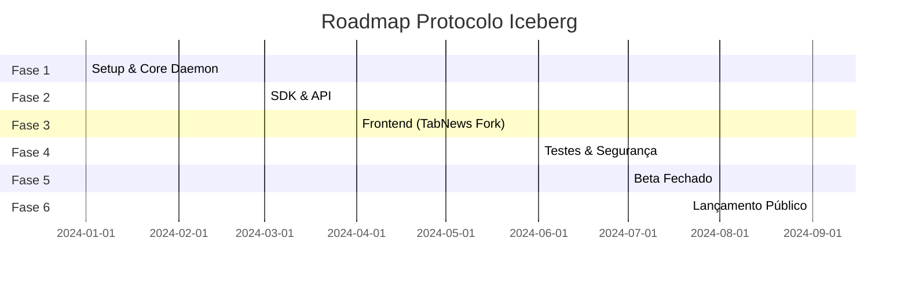

# 08. Roadmap de Desenvolvimento

> [!NOTE]
> **Status Atual (Dezembro 2024):**
> - ✅ Fase 1-4: Implementadas (MVP funcional)
> - ⏳ Fase 5-6: Próximas etapas
>
> O daemon foi implementado em TypeScript (não Go), mas todas as funcionalidades
> core estão operacionais: identidade, posts, votos, consenso, P2P foundation, 
> IPFS storage, CLI completa, E2E tests, CI/CD.

## Visão Geral

O desenvolvimento do Protocolo Iceberg está dividido em **6 fases**, cada uma com objetivos claros e entregáveis verificáveis.

---

## Timeline Resumido



---

## Fase 1: Fundação (Core Daemon)

**Duração estimada:** 8 semanas
**Objetivo:** Ter o "motor" P2P funcional

### Entregas

- [ ] **1.1 Setup do Monorepo**

  - Configurar Turborepo/Nx
  - Estrutura de pastas conforme [02_ARQUITETURA_DO_SISTEMA.md](./02_ARQUITETURA_DO_SISTEMA.md)
  - CI/CD básico (GitHub Actions)
  - Linting e formatação

- [ ] **1.2 Módulo de Identidade**

  - Geração de par de chaves ED25519
  - Export/Import (mnemonic, keyfile)
  - Assinatura de mensagens
  - Verificação de assinaturas

- [ ] **1.3 Integração IPFS**

  - Embed go-ipfs no daemon
  - Add/Pin de conteúdo
  - Get/Cat de conteúdo
  - Garbage collection

- [ ] **1.4 Rede P2P (Libp2p)**

  - DHT para discovery
  - PubSub para broadcast
  - NAT traversal
  - Bootstrap nodes

- [ ] **1.5 Banco de Dados Distribuído**

  - Setup OrbitDB ou GunDB
  - Schema de Posts
  - Schema de Votos
  - Índice por região

- [ ] **1.6 API HTTP Local**
  - Endpoints básicos (/posts, /votes)
  - Autenticação por assinatura
  - WebSocket para eventos

### Critérios de Aceite Fase 1

```
✓ Daemon inicia e conecta a pelo menos 3 peers
✓ Criar post e recuperá-lo por CID
✓ Votar em post e ver contagem atualizada
✓ Dois daemons em máquinas diferentes sincronizam
```

---

## Fase 2: SDK para Desenvolvedores

**Duração estimada:** 4 semanas
**Objetivo:** Biblioteca pronta para uso

### Entregas

- [ ] **2.1 SDK Core (TypeScript)**

  - Cliente HTTP para daemon
  - Wrapper de todas as APIs
  - Gerenciamento de identidade
  - Tipos TypeScript completos

- [ ] **2.2 Criptografia no Browser**

  - TweetNaCl.js para ED25519
  - Key derivation de mnemonic
  - Encriptação de arquivos

- [ ] **2.3 Subscriptions (Real-time)**

  - WebSocket client
  - Event emitters
  - Reconnection handling

- [ ] **2.4 Documentação**
  - JSDoc completo
  - README com exemplos
  - TypeDoc gerado
  - Publicação no NPM

### Critérios de Aceite Fase 2

```
✓ npm install @iceberg/sdk funciona
✓ Exemplo "Hello World" em < 10 linhas
✓ Todos os métodos documentados
✓ Testes unitários com >80% coverage
```

---

## Fase 3: Frontend (Fork TabNews)

**Duração estimada:** 8 semanas
**Objetivo:** Interface funcional para usuários

### Entregas

- [ ] **3.1 Fork e Limpeza**

  - Clone do TabNews
  - Remoção de infra/ e Postgres
  - Atualização de dependências
  - Ajuste de ESLint/Prettier

- [ ] **3.2 Autenticação por Chaves**

  - Página /auth/create
  - Página /auth/import
  - Exibição de mnemonic
  - Armazenamento seguro

- [ ] **3.3 Feed com Filtros**

  - Seletor de região
  - Filtro por nível
  - Indicadores visuais (bordas)
  - Paginação infinita

- [ ] **3.4 Criação de Posts**

  - Editor Markdown
  - Upload de anexos
  - Seleção de categoria
  - Campo de bounty

- [ ] **3.5 Sistema de Votos**

  - Botões Up/Down/Report
  - Assinatura de votos
  - Feedback visual
  - Contagem em tempo real

- [ ] **3.6 Página de Perfil**

  - Avatar gerado (Identicon)
  - Histórico de posts
  - Reputação/TrustScore
  - Configurações

- [ ] **3.7 Comentários**
  - Thread aninhada
  - Markdown support
  - Votos em comentários

### Critérios de Aceite Fase 3

```
✓ Criar conta, postar, votar, comentar
✓ Feed mostra posts por região
✓ Níveis visuais funcionam
✓ <3s para carregar feed
✓ Funciona em mobile (responsivo)
```

---

## Fase 4: Segurança e Testes

**Duração estimada:** 4 semanas
**Objetivo:** Sistema auditável e robusto

### Entregas

- [ ] **4.1 Testes E2E**

  - Playwright para frontend
  - Cenários de usuário completos
  - Testes de fluxo de bounty

- [ ] **4.2 Testes de Stress**

  - Carga de 1000 posts simultâneos
  - 10.000 votos em 1 minuto
  - Recovery de crash

- [ ] **4.3 Auditoria de Segurança**

  - Revisão de código
  - Análise de dependências
  - Penetration testing básico

- [ ] **4.4 Integração Tor (Opcional)**

  - Onion service no daemon
  - Configuração de fallback
  - Testes de anonimato

- [ ] **4.5 Rate Limiting**
  - Implementar limites
  - Proof of Work para spam
  - Blacklist temporária

### Critérios de Aceite Fase 4

```
✓ 0 vulnerabilidades críticas
✓ Testes passam em 100% dos casos
✓ Daemon sobrevive a crash e reinicia
✓ Não expõe IPs em logs
```

---

## Fase 5: Beta Fechado

**Duração estimada:** 8 semanas
**Objetivo:** Validar com usuários reais

### Entregas

- [ ] **5.1 Deploy de Infraestrutura**

  - 3 bootstrap nodes (BR, EU, US)
  - Gateway público de leitura
  - Monitoramento básico

- [ ] **5.2 Programa de Beta Testers**

  - 100-500 usuários convidados
  - Canal de feedback (Discord/Matrix)
  - Bug bounty informal

- [ ] **5.3 Onboarding**

  - Tutorial interativo
  - Vídeos explicativos
  - FAQ completo

- [ ] **5.4 Iteração**

  - Fixes baseados em feedback
  - Ajustes de UX
  - Performance tuning

- [ ] **5.5 Dados de Exemplo**
  - Seed de posts de teste
  - Categorias configuradas
  - Regiões brasileiras ativas

### Critérios de Aceite Fase 5

```
✓ 100+ usuários ativos por dia
✓ <5% de churn semanal
✓ NPS > 30
✓ Tempo médio no site > 5 minutos
```

---

## Fase 6: Lançamento Público

**Duração estimada:** 4 semanas
**Objetivo:** Open Beta para todos

### Entregas

- [ ] **6.1 Marketing**

  - Post no TabNews (irônico!)
  - Threads no Twitter/X
  - Artigo no Medium
  - Vídeo de apresentação

- [ ] **6.2 Documentação Final**

  - Site de docs (VitePress)
  - Guias de contribuição
  - Código de conduta

- [ ] **6.3 Governança**

  - Processo de propostas
  - Votação de mudanças
  - Roadmap comunitário

- [ ] **6.4 Escalabilidade**
  - CDN para assets estáticos
  - Mais bootstrap nodes
  - Sharding regional

### Critérios de Aceite Fase 6

```
✓ 1.000+ downloads do daemon
✓ 10+ posts Nível 2
✓ Cobertura de mídia
✓ Contribuidores externos no GitHub
```

---

## Backlog (Pós-Lançamento)

### Prioridade Alta

- [ ] App mobile (React Native)
- [ ] App desktop (Tauri/Electron)
- [ ] Token ICEBERG (se decidido)
- [ ] Integração com Monero/ZCash

### Prioridade Média

- [ ] Notificações push
- [ ] Editor WYSIWYG
- [ ] Tradução para espanhol
- [ ] Expansão para América Latina

### Prioridade Baixa

- [ ] API para bots
- [ ] Integração com Telegram
- [ ] Browser extension
- [ ] Modo offline completo

---

## Métricas de Sucesso

### KPIs por Fase

| Fase | Métrica Chave           | Target |
| ---- | ----------------------- | ------ |
| 1    | Peers conectados        | >10    |
| 2    | Downloads SDK           | >100   |
| 3    | Tempo de onboarding     | <2 min |
| 4    | Bugs críticos           | 0      |
| 5    | Usuários ativos diários | >100   |
| 6    | Posts Nível 2           | >10    |

### KPIs de Longo Prazo

| Métrica              | 6 meses | 1 ano   | 2 anos    |
| -------------------- | ------- | ------- | --------- |
| Usuários registrados | 10.000  | 100.000 | 1.000.000 |
| Posts totais         | 50.000  | 500.000 | 5.000.000 |
| Nós ativos           | 500     | 5.000   | 50.000    |
| Posts Nível 3        | 10      | 100     | 1.000     |

---

## Recursos Necessários

### Equipe Mínima (MVP)

| Função            | Dedicação | Responsabilidades      |
| ----------------- | --------- | ---------------------- |
| Backend (Go/Rust) | Full-time | Core daemon, P2P, IPFS |
| Frontend (React)  | Full-time | Interface, UX          |
| DevOps            | Part-time | CI/CD, infraestrutura  |

### Equipe Ideal (Lançamento)

| Função     | Dedicação    | Responsabilidades     |
| ---------- | ------------ | --------------------- |
| Tech Lead  | Full-time    | Arquitetura, revisão  |
| Backend    | 2x Full-time | Core, performance     |
| Frontend   | Full-time    | Interface completa    |
| Mobile     | Part-time    | Apps nativos          |
| DevOps/SRE | Full-time    | Infra, monitoramento  |
| Security   | Part-time    | Auditorias, hardening |
| Community  | Part-time    | Discord, suporte      |

### Custos Estimados (Infraestrutura)

| Item                    | Custo Mensal  |
| ----------------------- | ------------- |
| 3 Bootstrap Nodes (VPS) | $60-150       |
| Gateway público         | $50-100       |
| Arweave storage         | Variável      |
| Domínios                | $15/ano       |
| **Total MVP**           | **~$150/mês** |

---

## Próximos Passos Imediatos

1. **Clonar TabNews** e configurar monorepo
2. **Implementar módulo de identidade** (crypto)
3. **Setup básico de IPFS** embarcado
4. **Primeiro post de teste** ida e volta

---

## Documentos Relacionados

- [01_MANIFESTO_DO_PROJETO.md](./01_MANIFESTO_DO_PROJETO.md) - Visão e filosofia
- [02_ARQUITETURA_DO_SISTEMA.md](./02_ARQUITETURA_DO_SISTEMA.md) - Stack técnico
- [03_LOGICA_DE_CONSENSO.md](./03_LOGICA_DE_CONSENSO.md) - Sistema de níveis
- [04_ESPECIFICACAO_FRONTEND.md](./04_ESPECIFICACAO_FRONTEND.md) - Interface
- [05_TOKENOMICS_E_INCENTIVOS.md](./05_TOKENOMICS_E_INCENTIVOS.md) - Economia
- [06_SEGURANCA_E_PRIVACIDADE.md](./06_SEGURANCA_E_PRIVACIDADE.md) - Segurança
- [07_SDK_E_API.md](./07_SDK_E_API.md) - Documentação SDK
